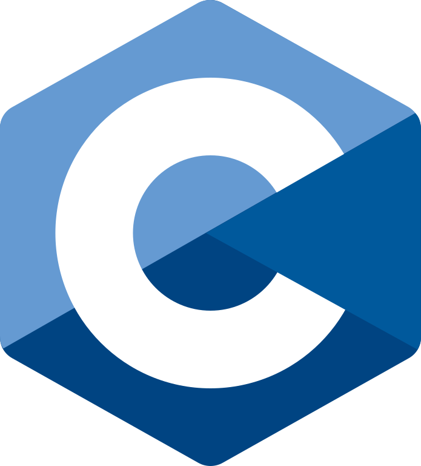
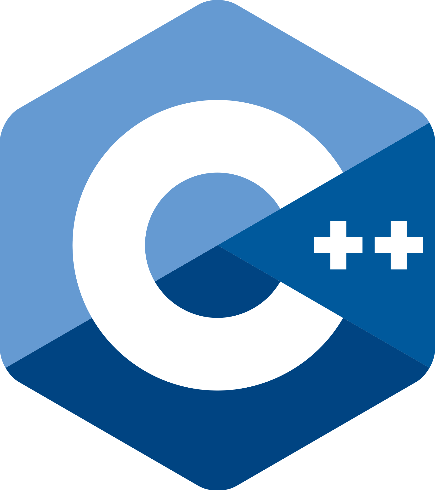
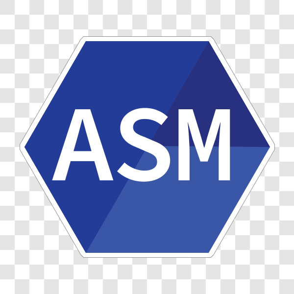
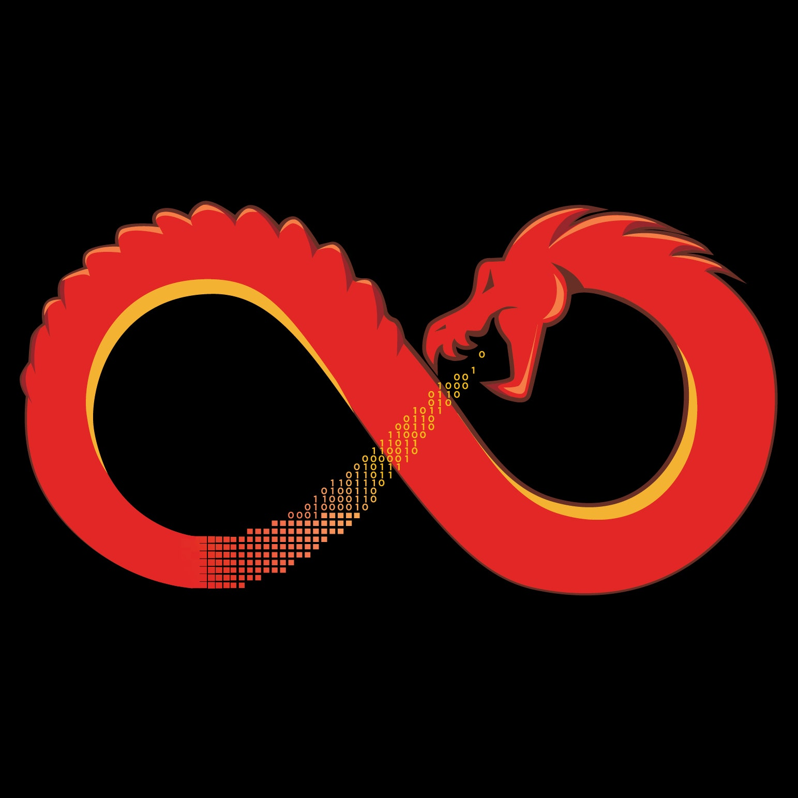
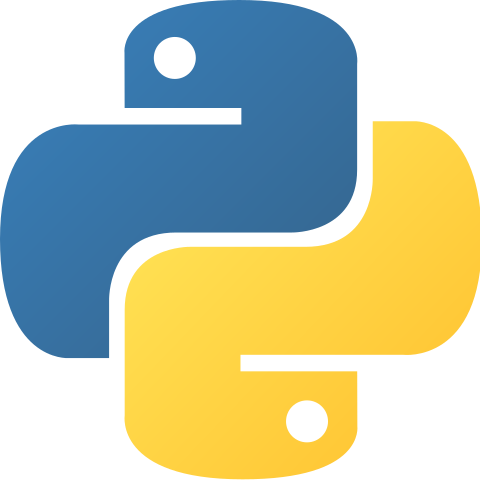
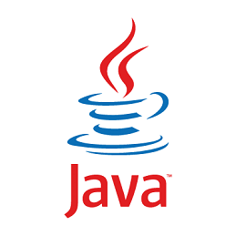
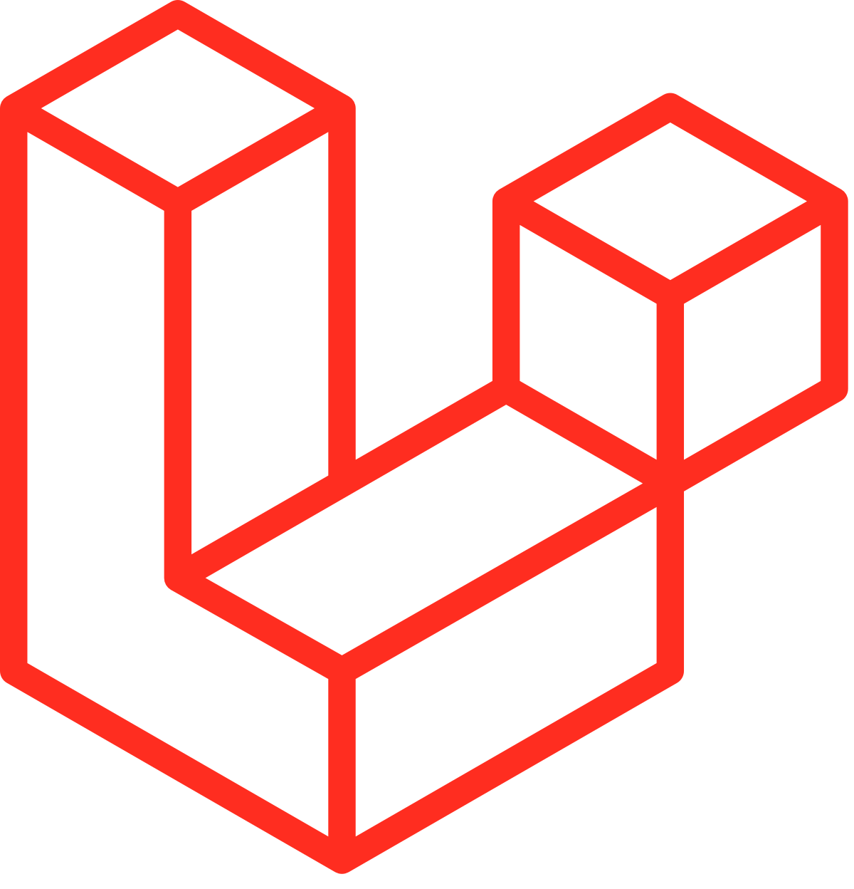
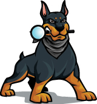

### 
 Hi👋, 我是 Kevin 智元 

來自台灣高雄一條有夢想的鹹魚 🐳,目前就讀於中央大學資管系(莫名其妙修了一堆資工的課),NCU DSC的一名成員,在資安 🛡️ 的路上前進?,偶爾刷刷 Leetcode,只不過路上有好多坑要填 QQ
到處都有大佬 🛐 在推坑好多看起來好棒的東西，github目前沒有甚麼看起來很厲害的東西QQ，下學期社課目標是教資安，雖然感覺有點困難，就試試看了

Hi😺, my name is Kevin , I live in Kaohsiung and I study in National university MIS(but I study more course in CS XD).I want to become a security analyst, but before success, there are a lot of knowledge that I need to learn.
There are a lot of fun in security:) 

### 
 🛡️Security is FUN🛡️ 

### 
 🛡️Coding is part of life🛡️ 

### 
 🛡️What I cannot create , I do not understand🛡️ 

	
  
	
	

### Languages and Tools:

	
	
	
	
	
	
	
	
	
	
	
	
	
	
	
	
	
	
	
	
	
	

